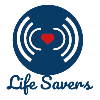

# Life Savers: A Blood Donation App

Our application connects patients promptly with a large pool of donors in the same region based on their location. A user can opt in to become a donor and have his/her contact information available to other users who are in need of blood donation. 

## Built With

The libraries/programming languages used in this mobile app are:
* Java
* MongoDB
* NodeJS
* Express
* Passport.js
* Mongoose
* Body-parser
* Express-session

## Authors

* **Wafic Lawand** - [Github](https://github.com/waficLawand)
* **Salwa Al Khatib** - [Github](https://github.com/salwaalkhatib)
